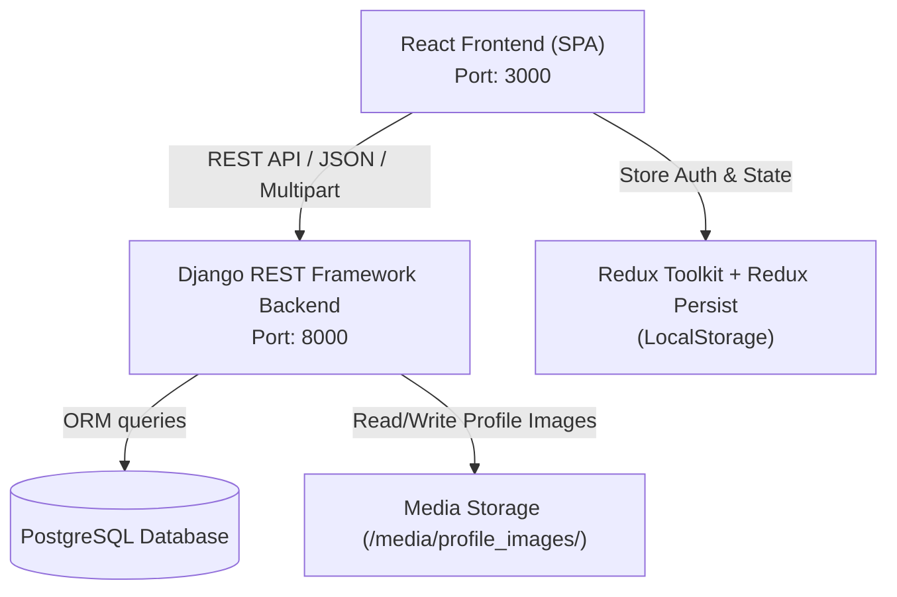

# Machine-Readable Repository Manifest: Django-React CRUD Application

This document provides a comprehensive, machine-readable architecture and implementation specification for the `django_react_crud` repository. It is designed to serve as an authoritative context reference for AI models and autonomous developer agents.

---

## 1. System Overview & Architectural Blueprint

The system is a decoupled full-stack web application consisting of a Django REST Framework (DRF) backend API and a React (Single Page Application) frontend client.



### Architectural Subsystems
- **Backend Service (`/backend`)**:
  - Engine: Python 3 / Django 5.1 / Django REST Framework 3.15.2
  - Database: PostgreSQL (accessed via `psycopg2-binary` 2.9.9)
  - Security & Authentication: JWT-based authentication via `djangorestframework-simplejwt` 5.3.1 with token blacklisting enabled (`rest_framework_simplejwt.token_blacklist`)
  - Image Handling: Django file storage with `Pillow` 10.4.0 serving media uploads at `/media/`
  - CORS Middleware: `django-cors-headers` allowing cross-origin requests from the React development server.

- **Frontend Service (`/frontend`)**:
  - Engine: Node.js / React 18.3.1 bootstrapped with `react-scripts` (Create React App)
  - State Management: `@reduxjs/toolkit` 2.2.7 with `redux-persist` 6.0.0 utilizing browser `localStorage`
  - Client Routing: `react-router-dom` 6.26.1 with custom Higher-Order Component (HOC) route guards
  - HTTP Client: `axios` 1.7.7 with custom request interceptors for JWT Bearer header injection
  - UI Components: Bootstrap 5.3.3 and `react-bootstrap` 2.10.4

---

## 2. Core Modules & Directory Layout

### Backend Directory Structure (`/backend`)
- [manage.py](file:///home/aswin/code/broto/django_react_crud/backend/manage.py): Django CLI execution script.
- [requirements.txt](file:///home/aswin/code/broto/django_react_crud/backend/requirements.txt): Python dependency specification.
- `backend/` (Project Configuration Package):
  - [settings.py](file:///home/aswin/code/broto/django_react_crud/backend/backend/settings.py): Application settings, database configuration, SimpleJWT setup, installed apps, and middleware pipeline.
  - [urls.py](file:///home/aswin/code/broto/django_react_crud/backend/backend/urls.py): Root URL routing configuration delegating `/api/` to `api.urls` and serving media files in debug mode.
  - [wsgi.py](file:///home/aswin/code/broto/django_react_crud/backend/backend/wsgi.py): WSGI entry point.
  - [asgi.py](file:///home/aswin/code/broto/django_react_crud/backend/backend/asgi.py): ASGI entry point.
- `api/` (Core Application Package):
  - [apps.py](file:///home/aswin/code/broto/django_react_crud/backend/api/apps.py): Application configuration registering post-save signals in `ready()`.
  - [models.py](file:///home/aswin/code/broto/django_react_crud/backend/api/models.py): Custom `User` model and `UserProfile` entity definitions.
  - [serializers.py](file:///home/aswin/code/broto/django_react_crud/backend/api/serializers.py): DRF serializers for user registration, authentication, and user object representation.
  - [views.py](file:///home/aswin/code/broto/django_react_crud/backend/api/views.py): API view classes for user profile CRUD, authentication flows, and admin user management.
  - [urls.py](file:///home/aswin/code/broto/django_react_crud/backend/api/urls.py): API endpoint route registrations.
  - [signals.py](file:///home/aswin/code/broto/django_react_crud/backend/api/signals.py): Post-save Django receivers automatically creating and syncing `UserProfile` instances.
  - [admin.py](file:///home/aswin/code/broto/django_react_crud/backend/api/admin.py): Admin interface registration for `User` and `UserProfile`.
  - `migrations/`:
    - [0001_initial.py](file:///home/aswin/code/broto/django_react_crud/backend/api/migrations/0001_initial.py): Initial database schema creation migration.
    - [0002_user_name.py](file:///home/aswin/code/broto/django_react_crud/backend/api/migrations/0002_user_name.py): Migration adding the `name` field to the custom `User` model.

### Frontend Directory Structure (`/frontend`)
- [package.json](file:///home/aswin/code/broto/django_react_crud/frontend/package.json): Node.js package definition and script runners.
- `src/`:
  - [index.js](file:///home/aswin/code/broto/django_react_crud/frontend/src/index.js): React DOM root render entry point mounting Redux `Provider` and `PersistGate`.
  - [App.js](file:///home/aswin/code/broto/django_react_crud/frontend/src/App.js): Main application route definitions using `react-router-dom`.
  - `app/`:
    - [store.js](file:///home/aswin/code/broto/django_react_crud/frontend/src/app/store.js): Redux store configuration wrapping `authReducer` with `redux-persist`.
  - `axios/`:
    - [axiosInstance.js](file:///home/aswin/code/broto/django_react_crud/frontend/src/axios/axiosInstance.js): Axios HTTP instance configured with `baseURL: "http://localhost:8000/api"` and `Authorization` request interceptor.
  - `features/auth/`:
    - [authSlice.js](file:///home/aswin/code/broto/django_react_crud/frontend/src/features/auth/authSlice.js): Redux slice defining auth state, action reducers, and `logoutUser` async thunk.
  - `components/User/`:
    - `AddUser/`:
      - [AddUser.jsx](file:///home/aswin/code/broto/django_react_crud/frontend/src/components/Admin/AddUser/AddUser.jsx): Admin form for registering new users.
    - `AdminHome/`:
      - [AdminHome.jsx](file:///home/aswin/code/broto/django_react_crud/frontend/src/components/Admin/AdminHome/AdminHome.jsx): Admin management dashboard for listing, searching, editing, blocking/unblocking, and deleting users.
      - [AdminHome.css](file:///home/aswin/code/broto/django_react_crud/frontend/src/components/Admin/AdminHome/AdminHome.css): Styling for admin home layout.
    - `AdminLogin/`:
      - [AdminLogin.jsx](file:///home/aswin/code/broto/django_react_crud/frontend/src/components/Admin/AdminLogin/AdminLogin.jsx): Dedicated login interface for administrator accounts.
      - [AdminLogin.css](file:///home/aswin/code/broto/django_react_crud/frontend/src/components/Admin/AdminLogin/AdminLogin.css): Admin login form styling.
    - `RoutesAccess/`:
      - [AdminOnlyRoutes.jsx](file:///home/aswin/code/broto/django_react_crud/frontend/src/components/Admin/RoutesAccess/AdminOnlyRoutes.jsx): Route guard restricting child routes to authenticated admins (`isAdmin == true`).
    - `EditProfile/`:
      - [EditProfile.jsx](file:///home/aswin/code/broto/django_react_crud/frontend/src/components/User/EditProfile/EditProfile.jsx): User profile edit view for updating name, email, and avatar image.
      - [EditProfile.css](file:///home/aswin/code/broto/django_react_crud/frontend/src/components/User/EditProfile/EditProfile.css): CSS styles for edit profile page.
    - `Form/`:
      - [AuthForm.js](file:///home/aswin/code/broto/django_react_crud/frontend/src/components/User/Form/AuthForm.js): Unified authentication form handling both user Login and Sign Up.
      - [AuthForm.css](file:///home/aswin/code/broto/django_react_crud/frontend/src/components/User/Form/AuthForm.css): CSS styles for auth form.
    - `Home/`:
      - [Home.jsx](file:///home/aswin/code/broto/django_react_crud/frontend/src/components/User/Home/Home.jsx): User landing page post-login.
      - [Home.css](file:///home/aswin/code/broto/django_react_crud/frontend/src/components/User/Home/Home.css): Styling for user home page.
    - [LoginAndRegister.jsx](file:///home/aswin/code/broto/django_react_crud/frontend/src/components/User/LoginAndRegister.jsx): Wrapper components exporting `LoginPage` and `RegisterPage`.
    - `Navbar/`:
      - [Navbar.jsx](file:///home/aswin/code/broto/django_react_crud/frontend/src/components/User/Navbar/Navbar.jsx): Top navigation bar component with profile link and logout trigger.
    - [ProtectedRoutes.jsx](file:///home/aswin/code/broto/django_react_crud/frontend/src/components/User/ProtectedRoutes.jsx): Route guard restricting views to authenticated users with valid JWT.
    - [RestrictedRoute.jsx](file:///home/aswin/code/broto/django_react_crud/frontend/src/components/User/RestrictedRoute.jsx): Route guard redirecting authenticated users away from auth pages (`/login`, `/register`, `/admin/login`).
    - `UserProfile/`:
      - [UserProfile.jsx](file:///home/aswin/code/broto/django_react_crud/frontend/src/components/User/UserProfile/UserProfile.jsx): User profile view displaying username, name, email, and profile avatar.
      - [UserProfile.css](file:///home/aswin/code/broto/django_react_crud/frontend/src/components/User/UserProfile/UserProfile.css): Profile page stylesheet.

---

## 3. Database Schemas & Data Models

The backend configures PostgreSQL via Django ORM. The custom user model replaces the default Django user model (`AUTH_USER_MODEL = 'api.User'`).

```sql
-- Schema representation of backend/api/models.py

CREATE TABLE api_user (
    id BIGSERIAL PRIMARY KEY,
    password VARCHAR(128) NOT NULL,
    last_login TIMESTAMPTZ NULL,
    is_superuser BOOLEAN NOT NULL,
    username VARCHAR(150) UNIQUE NOT NULL,
    first_name VARCHAR(150) NOT NULL,
    last_name VARCHAR(150) NOT NULL,
    is_staff BOOLEAN NOT NULL,
    is_active BOOLEAN NOT NULL,
    date_joined TIMESTAMPTZ NOT NULL,
    email VARCHAR(254) UNIQUE NOT NULL,
    name VARCHAR(100) NOT NULL DEFAULT ''
);

CREATE TABLE api_userprofile (
    id BIGSERIAL PRIMARY KEY,
    user_id BIGINT UNIQUE NOT NULL REFERENCES api_user(id) ON DELETE CASCADE,
    profile_image VARCHAR(100) NULL
);
```

### Django Model Definitions (`backend/api/models.py`)

#### 1. `User` Model
Extends `django.contrib.auth.models.AbstractUser`.
- `email`: `models.EmailField(unique=True)` - Mandatory unique email address.
- `name`: `models.CharField(max_length=100, default='')` - Full name string.
- `username`: Standard Django `AbstractUser` field (unique string).
- `is_active`: Standard boolean flag indicating active/blocked status.
- `is_staff`: Standard boolean flag indicating administrative privileges.

#### 2. `UserProfile` Model
Extends `django.db.models.Model`.
- `user`: `models.OneToOneField(User, on_delete=models.CASCADE)` - Cascade-deleted link to `User`.
- `profile_image`: `models.ImageField(upload_to='profile_images/', null=True, blank=True)` - Image asset path.

#### Signal Mechanisms (`backend/api/signals.py`)
- `@receiver(post_save, sender=User) create_user_profile`: Automatically creates an associated `UserProfile` instance whenever a new `User` is inserted into the database.
- `@receiver(post_save, sender=User) save_user_profile`: Automatically calls `.save()` on `user.userprofile` whenever the `User` object is updated.

---

## 4. Frontend State Management Architecture

Global state is managed using Redux Toolkit (`@reduxjs/toolkit`) and persisted across sessions using `redux-persist`.

### Redux State Tree Schema (`auth` slice)

```typescript
interface AuthState {
    username: string;       // Logged-in user's username
    email: string;          // Logged-in user's email
    name: string;           // Logged-in user's full name
    error: string | null;   // Error message string for UI alerts
    accessToken: string | null;  // JWT Access Token string
    refreshToken: string | null; // JWT Refresh Token string
    isAdmin: boolean;       // Boolean flag indicating if admin session is active
}
```

### Redux Actions & Thunks (`backend/src/features/auth/authSlice.js`)
- `setUsername(payload: string)`: Updates `state.username`.
- `setEmail(payload: string)`: Updates `state.email`.
- `setName(payload: string)`: Updates `state.name`.
- `setAccessToken(payload: string)`: Updates `state.accessToken`.
- `setRefreshToken(payload: string)`: Updates `state.refreshToken`.
- `setIsAdmin(payload: boolean)`: Updates `state.isAdmin`.
- `clearAuth()`: Resets `username`, `email`, `name`, `error`, `accessToken`, and `refreshToken` to default empty values.
- `setError(payload: string | null)`: Updates `state.error`.
- `logoutUser` (Async Thunk): Sends a `POST` request to `/logout/` with `refresh_token`, removes tokens from `localStorage`, and dispatches `clearAuth()`.

### Persistence Configuration (`frontend/src/app/store.js`)
- Persistence Engine: `redux-persist/lib/storage` (Browser `localStorage`).
- Persist Key: `'root'`.
- Applied Reducer: `authReducer`.
- Middleware: Custom middleware setting `serializableCheck: false`.

---

## 5. API Endpoints & Integration Interface

All API routes are prefixed under `/api/` as defined in [backend/urls.py](file:///home/aswin/code/broto/django_react_crud/backend/backend/urls.py) and registered in [api/urls.py](file:///home/aswin/code/broto/django_react_crud/backend/api/urls.py).

| HTTP Method | Endpoint URL Path | View Class | Permission Level | Description & Payload Specs |
| :--- | :--- | :--- | :--- | :--- |
| `POST` | `/api/token/` | `TokenObtainPairView` | `AllowAny` | Obtains JWT pair (`access`, `refresh`) using credentials. |
| `POST` | `/api/token/refresh/` | `TokenRefreshView` | `AllowAny` | Generates a new access token using body `{ "refresh": "<token>" }`. |
| `POST` | `/api/register/` | [RegisterView](file:///home/aswin/code/broto/django_react_crud/backend/api/views.py#L12) | `AllowAny` | Registers a new user. Body: `{ username, name, email, password }`. Returns `{ refresh, access }` (HTTP 201). |
| `POST` | `/api/login/` | [LoginView](file:///home/aswin/code/broto/django_react_crud/backend/api/views.py#L31) | `AllowAny` | Authenticates user. Body: `{ username, password }`. Returns `{ refresh, access }` (HTTP 200). |
| `POST` | `/api/logout/` | [LogoutView](file:///home/aswin/code/broto/django_react_crud/backend/api/views.py#L47) | `IsAuthenticated` | Blacklists refresh token. Body: `{ refresh_token }`. Returns HTTP 205 RESET CONTENT. |
| `GET` | `/api/profile/` | [UserProfileView](file:///home/aswin/code/broto/django_react_crud/backend/api/views.py#L60) | `IsAuthenticated` | Returns authenticated user details: `{ name, email, profile_image }`. |
| `PUT` | `/api/profile/edit/` | [UserProfileEditView](file:///home/aswin/code/broto/django_react_crud/backend/api/views.py#L75) | `IsAuthenticated` | Updates user profile. Form Data: `name`, `email`, optional `profile_image` file. |
| `POST` | `/api/adminlogin/` | [AdminLoginView](file:///home/aswin/code/broto/django_react_crud/backend/api/views.py#L104) | `AllowAny` | Authenticates admin user. Validates `user.is_staff == True`. Returns `{ refresh, access }` or 403 Forbidden. |
| `GET` | `/api/admin/userlist/` | [UserListView](file:///home/aswin/code/broto/django_react_crud/backend/api/views.py#L125) | `IsAdminUser` | Returns a list of all registered users serialized via `UserSerializer`. |
| `PATCH` | `/api/admin/user/edit/<user_id>/` | [AdminUserEditView](file:///home/aswin/code/broto/django_react_crud/backend/api/views.py#L131) | `IsAdminUser` | Admin updates user record (`username`, `name`, `email`, `is_active`, optional `profile_image`). |
| `PATCH` | `/api/admin/user/block/<user_id>/` | [AdminUserBlockUnblockView](file:///home/aswin/code/broto/django_react_crud/backend/api/views.py#L159) | `IsAdminUser` | Updates user's `is_active` boolean status. Body: `{ is_active: boolean }`. |
| `DELETE` | `/api/admin/user/delete/<user_id>/` | [DeleteUserView](file:///home/aswin/code/broto/django_react_crud/backend/api/views.py#L178) | `IsAdminUser` | Deletes the specified user record permanently from the database. |

---

## 6. Frontend Routing & Access Control

Frontend routing is managed by `react-router-dom` in [App.js](file:///home/aswin/code/broto/django_react_crud/frontend/src/App.js). Access control is enforced using three custom wrapper components:

```
[Incoming Request Path]
   │
   ├─► /login, /register, /admin/login ──► RestrictedRoute ──► Redirects to / if JWT active & valid
   │
   ├─► /, /profile, /editprofile ─────────► ProtectedRoute ───► Redirects to /login if JWT missing/invalid
   │
   └─► /admin, /admin/add-user ──────────► AdminOnlyRoutes ──► Redirects to /admin/login if missing JWT or isAdmin == false
```

### Route Guard Implementations
1. **`ProtectedRoute` ([ProtectedRoutes.jsx](file:///home/aswin/code/broto/django_react_crud/frontend/src/components/User/ProtectedRoutes.jsx))**:
   - Checks `localStorage.getItem('ACCESS_TOKEN')`.
   - Decodes token using `jwt-decode` to verify expiration timestamp (`exp`).
   - If expired, sends POST request to `/token/refresh/` with `REFRESH_TOKEN` to retrieve new `access` token.
   - If missing or refresh fails, navigates to `/login`.

2. **`RestrictedRoute` ([RestrictedRoute.jsx](file:///home/aswin/code/broto/django_react_crud/frontend/src/components/User/RestrictedRoute.jsx))**:
   - Inspects access token validity.
   - If token is present and valid, redirects user to home page (`/`).
   - Prevents authenticated users from viewing `/login`, `/register`, or `/admin/login`.

3. **`AdminOnlyRoutes` ([AdminOnlyRoutes.jsx](file:///home/aswin/code/broto/django_react_crud/frontend/src/components/Admin/RoutesAccess/AdminOnlyRoutes.jsx))**:
   - Validates access token expiration via `jwt-decode`.
   - Reads `isAdmin` state property from Redux store (`state.auth.isAdmin`).
   - Navigates to `/admin/login` if token is invalid or `isAdmin` is `false`.

---

## 7. Environment Setup & Dependency Specifications

### Backend Setup Requirements
- **Python Dependencies ([requirements.txt](file:///home/aswin/code/broto/django_react_crud/backend/requirements.txt))**:
  - `Django==5.1`
  - `djangorestframework==3.15.2`
  - `djangorestframework-simplejwt==5.3.1`
  - `django-cors-headers==4.4.0`
  - `environs==11.0.0`
  - `psycopg2==2.9.9` & `psycopg2-binary==2.9.9`
  - `pillow==10.4.0`
  - `python-dotenv==1.0.1`

- **Backend Environment Configuration (`/backend/.env`)**:
  - Configured via `environs` in [settings.py](file:///home/aswin/code/broto/django_react_crud/backend/backend/settings.py#L17-L18):
    - `SECRET_KEY`: Django secret key string.
    - `DEBUG`: Boolean (e.g., `True` or `False`).
    - `DB_NAME`: PostgreSQL database name.
    - `DB_USER`: PostgreSQL database user.
    - `DB_PASSWORD`: PostgreSQL database user password.
    - `DB_HOST`: PostgreSQL database host (defaults to `"localhost"`).
    - `DB_PORT`: PostgreSQL database port (defaults to `5432`).

### Frontend Setup Requirements
- **Node.js Dependencies ([package.json](file:///home/aswin/code/broto/django_react_crud/frontend/package.json))**:
  - `react`: `^18.3.1`
  - `@reduxjs/toolkit`: `^2.2.7`
  - `redux-persist`: `^6.0.0`
  - `react-redux`: `^9.1.2`
  - `react-router-dom`: `^6.26.1`
  - `axios`: `^1.7.7`
  - `jwt-decode`: `^4.0.0`
  - `bootstrap`: `^5.3.3` & `react-bootstrap`: `^2.10.4`
  - `react-icons`: `^5.3.0`

---

## 8. Documented Codebase Implementation Quirks & Legacy Behaviors

The following technical implementation details exist in the current codebase state:

1. **Direct Axios Calls vs `axiosInstance`**:
   - `AuthForm.js` ([AuthForm.js:L47](file:///home/aswin/code/broto/django_react_crud/frontend/src/components/User/Form/AuthForm.js#L47)) and `AdminLogin.jsx` ([AdminLogin.jsx:L17](file:///home/aswin/code/broto/django_react_crud/frontend/src/components/Admin/AdminLogin/AdminLogin.jsx#L17)) make direct `axios.post('http://localhost:8000/api/login/')` / `adminlogin/` calls with hardcoded strings, bypassing the centralized `axiosInstance.js`.
2. **Endpoint Path Typo in `RestrictedRoute.jsx`**:
   - In `RestrictedRoute.jsx` ([RestrictedRoute.jsx:L13](file:///home/aswin/code/broto/django_react_crud/frontend/src/components/User/RestrictedRoute.jsx#L13)), the `refreshToken` helper calls `axiosInstance.post('/api/token/refresh/', ...)`. Because `axiosInstance` already defines `baseURL: "http://localhost:8000/api"`, this generates an outbound request to `http://localhost:8000/api/api/token/refresh/`.
3. **Client-Controlled `isAdmin` Redux Flag**:
   - The `isAdmin` flag in `authSlice` is toggled manually on the client side upon successful submission of `AdminLogin.jsx` (`dispatch(setIsAdmin(true))`) ([AdminLogin.jsx:L41](file:///home/aswin/code/broto/django_react_crud/frontend/src/components/Admin/AdminLogin/AdminLogin.jsx#L41)), rather than being decoded directly from claims in the JWT token or verified from the server on refresh.
4. **Dual Storage of Authentication Tokens**:
   - Access and Refresh tokens are stored simultaneously in both the Redux store (`auth.accessToken`, `auth.refreshToken`) and standard `localStorage` (`ACCESS_TOKEN`, `REFRESH_TOKEN`). `axiosInstance.js` explicitly reads tokens from `localStorage`.
